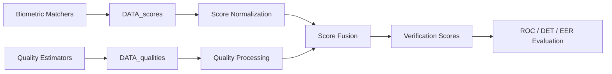

<div align="center">


# 🛂 ScoreFusionABC

### Score Fusion in Multimodal Automated Border Control Systems

[](https://www.mathworks.com/products/matlab.html)
[](LICENSE)
[](https://ieeexplore.ieee.org/document/7736922)
[](http://iebil.di.unimi.it/projects/abc4eu)
[](#overview)

**MATLAB source code for the BIOSIG 2016 paper**  
*Enhancing the performance of multimodal Automated Border Control systems*

</div>

---

## 🧠 Overview

**ScoreFusionABC** provides a MATLAB implementation of score-level fusion methods for **multimodal biometric verification** in the context of **Automated Border Control (ABC)** systems.

The code is designed to combine biometric matcher outputs and quality information from multiple modalities in order to improve verification performance in border-control scenarios.

Typical modalities in multimodal ABC pipelines may include face, fingerprint, iris, or other biometric traits. This repository focuses on the **fusion stage**, assuming that biometric scores and quality measures are already computed by external biometric systems.

---

## 🇪🇺 ABC4EU Context

<div align="center">


</div>

This repository is related to the **ABC4EU European project**, which investigated next-generation Automated Border Control technologies and multimodal biometric processing.

Project page:

```text
http://iebil.di.unimi.it/projects/abc4eu
```

---

## 🔬 Processing Pipeline

<div align="center">



</div>

The repository implements a complete experimental workflow for:

- loading biometric scores and quality indicators,
- preparing genuine and impostor comparisons,
- applying score normalization and fusion strategies,
- estimating performance using biometric verification metrics,
- generating plots and statistics for analysis.

---

## 📁 Repository Structure

```text
ScoreFusionABC/
│
├── launch_scoreFusionABC.m     # Main MATLAB entry point
│
├── DATA_scores/                # Input biometric scores
├── DATA_qualities/             # Input biometric quality measures
│
├── biometricUtil/              # Biometric utility functions
├── calcoloROC/                 # ROC / DET / error-rate computation utilities
├── fusions/                    # Score fusion algorithms
├── mixturecode2/               # Finite mixture model utilities
├── mLib/                       # Supporting MATLAB library functions
├── util/                       # General-purpose helper functions
│
├── LICENSE                     # GPL-3.0 license
└── README.md
```

---

## 🚀 Getting Started

### 1. Clone the repository

```bash
git clone https://github.com/AngeloUNIMI/ScoreFusionABC.git
cd ScoreFusionABC
```

### 2. Prepare the input data

The code expects pre-computed biometric scores and quality values in the following folders:

```text
./DATA_scores/
./DATA_qualities/
```

These values must be generated by external biometric matchers or quality-estimation software.

See the `.dat` files in the repository for the expected input format.

### 3. Run the main script

Open MATLAB from the repository root and run:

```matlab
launch_scoreFusionABC
```

---

## 📊 Outputs

The framework supports analysis of biometric verification performance through metrics and plots such as:

| Output | Description |
|---|---|
| Genuine/impostor scores | Score distributions for biometric comparisons |
| ROC curves | Receiver Operating Characteristic analysis |
| DET curves | Detection Error Tradeoff visualization |
| EER | Equal Error Rate |
| Fusion scores | Combined multimodal verification scores |
| Quality-aware analysis | Use of biometric quality information in fusion |

---

## 🧩 Implemented / Referenced Fusion Ideas

The repository includes code and experimental routines related to several score fusion strategies, including methods inspired by:

- likelihood-ratio-based biometric score fusion,
- quality-aware score fusion,
- finite mixture models,
- kernel Fisher discriminant analysis,
- weighted score combinations for multibiometric systems.

---

## 📚 Related Methods and Dependencies

Part of the code uses or refers to the following works and libraries.

### Finite Mixture Models

M. Figueiredo and A. K. Jain,  
**“Unsupervised learning of finite mixture models,”**  
*IEEE Transactions on Pattern Analysis and Machine Intelligence*, vol. 24, no. 3, pp. 381–396, 2002.

```text
http://www.lx.it.pt/~mtf/
http://www.lx.it.pt/~mtf/mixturecode2.zip
```

### VLFeat

A. Vedaldi and B. Fulkerson,  
**“VLFeat: An Open and Portable Library of Computer Vision Algorithms,”** 2008.

```text
http://www.vlfeat.org/
```

### Biometric Score Fusion References

- K. Nandakumar, Y. Chen, S. Dass, and A. Jain,  
  **“Likelihood ratio-based biometric score fusion,”**  
  *IEEE Transactions on Pattern Analysis and Machine Intelligence*, 2008.

- S. Mika, G. Rätsch, J. Weston, B. Schölkopf, and K. R. Müller,  
  **“Fisher discriminant analysis with kernels,”**  
  *Neural Networks for Signal Processing IX*, 1999.

- C. Chia, N. Sherkat, and L. Nolle,  
  **“Towards a best linear combination for multimodal biometric fusion,”**  
  *ICPR*, 2010.

- N. Damer, A. Opel, and A. Nouak,  
  **“Biometric source weighting in multi-biometric fusion: towards a generalized and robust solution,”**  
  *EUSIPCO*, 2014.

---

## 📖 Paper

If you use this repository, please cite:

```bibtex
@InProceedings{biosig16,
  author    = {A. Anand and R. Donida Labati and A. Genovese and E. Muñoz and V. Piuri and F. Scotti and G. Sforza},
  title     = {Enhancing the performance of multimodal Automated Border Control systems},
  booktitle = {Proc. of the 15th Int. Conf. of the Biometrics Special Interest Group (BIOSIG 2016)},
  address   = {Darmstadt, Germany},
  pages     = {1--5},
  month     = {September},
  year      = {2016},
  doi       = {10.1109/BIOSIG.2016.7736922}
}
```

Paper:

```text
https://ieeexplore.ieee.org/document/7736922
```

---

## 👥 Authors

**A. Anand**, **R. Donida Labati**, **A. Genovese**, **E. Muñoz**, **V. Piuri**, **F. Scotti**, and **G. Sforza**

---

## 📄 License

This project is released under the **GNU General Public License v3.0**.

See the [LICENSE](LICENSE) file for details.
